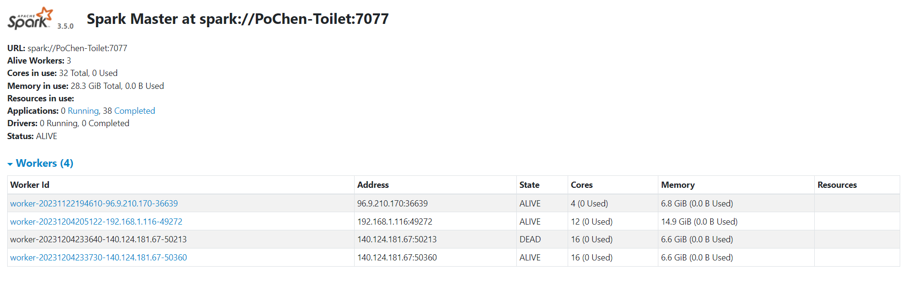

# BigData-HW04
## Class : BigData Mining And Applications 321524 at NTUT
## By: [Yasar Nazzarian](https://github.com/Yasar2019) 1120120349 IEECS and [郭柏辰 PoChenKuo](https://github.com/PoChenKuo) 112599003 資工博一/computer science first-year PhD student
----------------------------------------------------------------------------------------------
### **Cluser Info**


### 1. Project Setup and Information
#### 1.1. Environment
* **Python 3.11.4**
* **Java:**
``openjdk version "17.0.1" 2021-10-19
OpenJDK Runtime Environment Temurin-17.0.1+12 (build 17.0.1+12)
OpenJDK 64-Bit Server VM Temurin-17.0.1+12 (build 17.0.1+12, mixed mode, sharing)``
* **Spark 3.5.0**
* **Scala 3.3.1**

#### 1.2. Input

* **Input file:** [Data](/ml-1m)
* **Input file size:** ** MB
* **Input file format:** .dat

#### 1.3. Output
#### You can find all the output files (Task #1,2,3) in the folder named "output"
* **Output files:** [output](output)
* **Output files format:** csv
* 
* 

#### 1.4. Code
* **Code:** [HW04.py](HW04.py)

### 2. How to run the code
```spark-submit --master spark://96.9.210.170:7077 HW04.py ```
